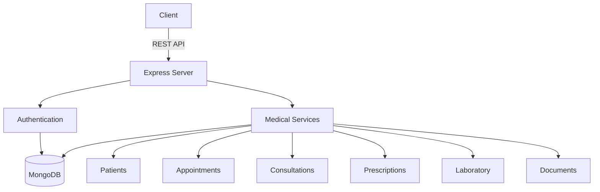
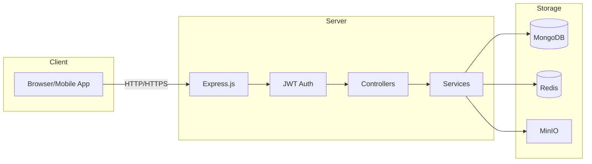
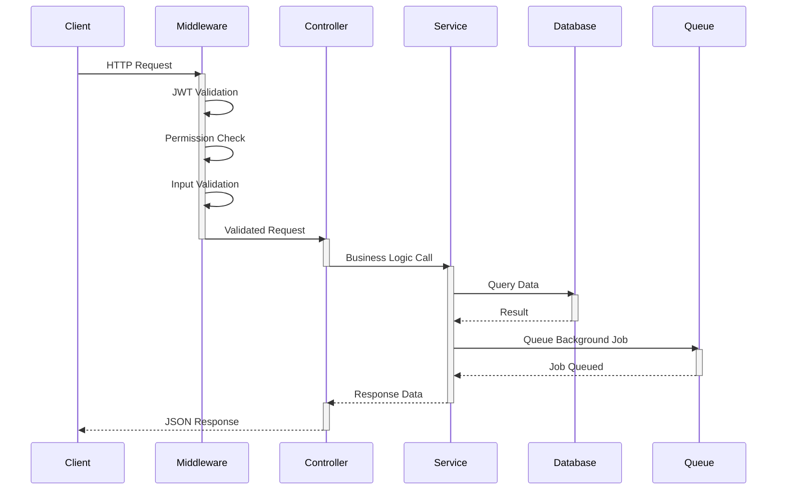
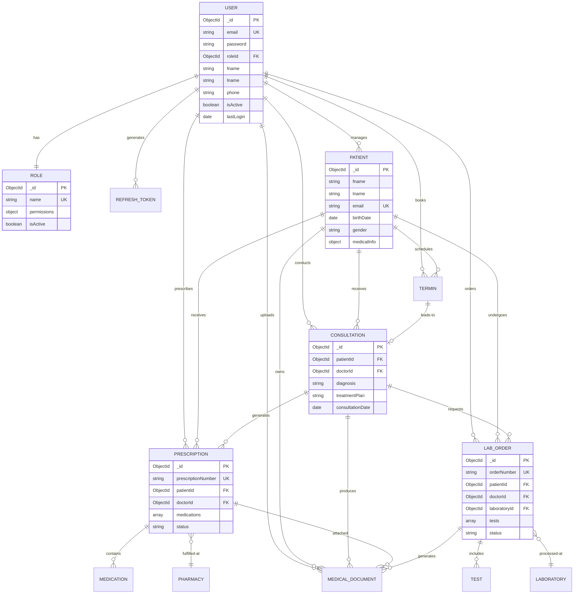
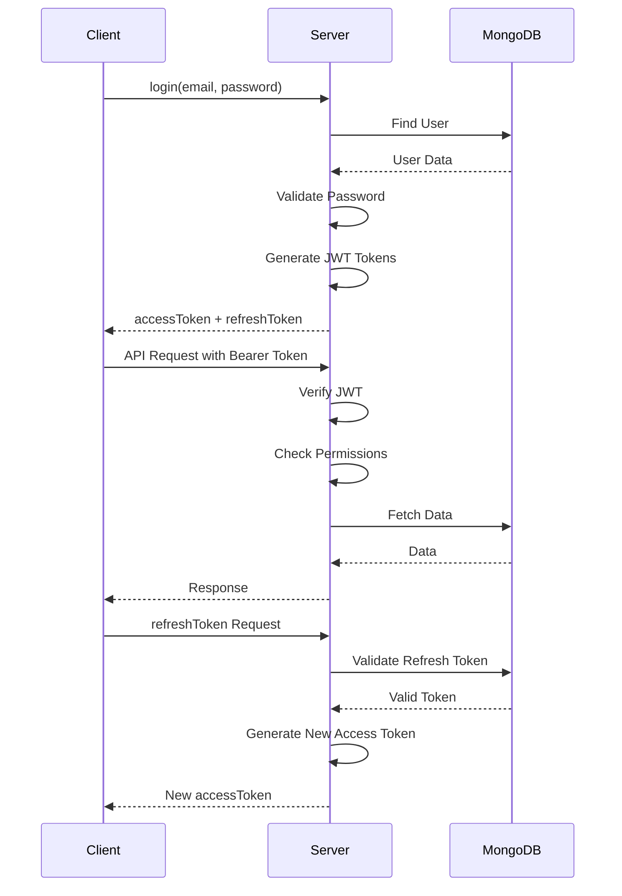
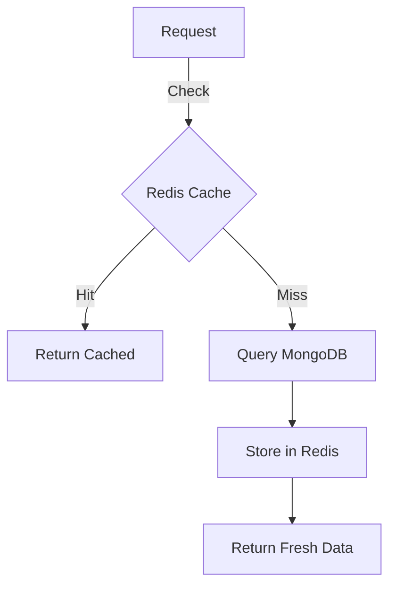

<div align="center">

# HealthPulse

### Modern Healthcare Management System

[](https://nodejs.org/)
[](https://expressjs.com/)
[](https://www.mongodb.com/)
[](https://www.docker.com/)
[](https://redis.io/)
[](https://jwt.io/)

---

### Complete Medical Management Solution with Advanced Features



</div>

## Architecture



## Tech Stack

```
HealthPulse/
├── app/
│   ├── abstractions/          # Base classes
│   │   ├── BaseController.js
│   │   └── BaseServise.js
│   ├── config/                # Configuration files
│   │   ├── db.js             # MongoDB connection (Singleton)
│   │   └── email.js          # Email configuration
│   ├── constants/             # Application constants
│   │   ├── roles.js          # Role & permission definitions
│   │   └── statusCodes.js    # HTTP & status codes
│   ├── controllers/           # Request handlers
│   │   ├── AuthController.js
│   │   ├── PatientController.js
│   │   ├── TerminController.js
│   │   └── UserController.js
│   ├── database/              # Database utilities
│   │   └── seed.js           # Database seeder
│   ├── middlewares/           # Express middlewares
│   │   ├── auth.js
│   │   ├── errorHandler.js
│   │   ├── permission.js
│   │   ├── requestLogger.js
│   │   └── validation.js
│   ├── models/                # Mongoose models
│   │   ├── Patient.js
│   │   ├── Role.js
│   │   ├── Termin.js
│   │   └── User.js
│   ├── queue/                 # Background jobs
│   │   └── emailQueue.js     # Email queue with Bull
│   ├── repositories/          # Data access layer
│   ├── routes/                # API routes
│   │   ├── v1/
│   │   │   ├── auth.routes.js
│   │   │   ├── index.js
│   │   │   └── users.js
│   │   └── index.js
│   ├── security/              # Security utilities
│   │   ├── encryption.js
│   │   ├── permissions.js
│   │   └── secrets.js
│   ├── services/              # Business logic
│   │   ├── AppointmentService.js
│   │   ├── AuthService.js
│   │   ├── EmailService.js
│   │   └── PatientService.js
│   ├── tests/                 # Test files
│   │   ├── e2e/
│   │   ├── integration/
│   │   └── unit/
│   ├── utils/                 # Utility functions
│   │   ├── crypto.js
│   │   ├── jwt.js
│   │   └── validators.js
│   └── validators/            # Input validation
│       ├── AuthValidator.js
│       ├── PatientValidator.js
│       ├── TerminSchema.js
│       ├── UserValidator.js
│       └── ValidationSchema.js
├── bin/
│   └── www.js                 # Server entry point
├── Docker/
│   ├── .dockerignore
│   ├── docker-compose.yml
│   └── Dockerfile
├── scripts/
│   └── seed.js               # Seed script runner
├── tests/                     # Root test directory
├── .env                       # Environment variables (not in git)
├── .env.example              # Environment template
├── .gitignore
├── app.js                    # Express app configuration
├── docker-compose.yml
├── Dockerfile
├── medical.drawio            # Database diagram
├── package.json
└── README.md
```

## 🚀 Tech Stack

<table>
<tr>
<td align="center" width="25%">
<br/>
<b>Node.js</b><br/>
<sub>Runtime Environment</sub>
</td>
<td align="center" width="25%">
<br/>
<b>Express.js</b><br/>
<sub>Web Framework</sub>
</td>
<td align="center" width="25%">
<br/>
<b>MongoDB</b><br/>
<sub>NoSQL Database</sub>
</td>
<td align="center" width="25%">
<br/>
<b>Docker</b><br/>
<sub>Containerization</sub>
</td>
</tr>
<tr>
<td align="center" width="25%">
<br/>
<b>Redis</b><br/>
<sub>Cache & Queue</sub>
</td>
<td align="center" width="25%">
<br/>
<b>JWT</b><br/>
<sub>Authentication</sub>
</td>
<td align="center" width="25%">
<br/>
<b>Postman</b><br/>
<sub>API Testing</sub>
</td>
<td align="center" width="25%">
<br/>
<b>Git</b><br/>
<sub>Version Control</sub>
</td>
</tr>
</table>

## Core Features

- **Authentication & Authorization**
  - JWT-based authentication with refresh tokens
  - Role-Based Access Control (RBAC)
  - Password encryption with bcrypt
  - Secure session management

- **User Management**
  - Multi-role system (Admin, Doctor, Nurse, Lab Technician, Pharmacist, Receptionist, Patient)
  - User CRUD operations
  - Profile management
  - Activity tracking

- **Patient Management**
  - Complete patient records
  - Medical history tracking
  - Emergency contact information
  - Insurance details

- **Appointment System**
  - Smart scheduling with conflict detection
  - Multiple appointment types
  - Status tracking (Scheduled, Completed, Cancelled)
  - Reminder notifications

- **Consultations**
  - Detailed medical examinations
  - Diagnosis and treatment plans
  - Vital signs tracking
  - Follow-up management

- **Prescriptions**
  - Digital prescription generation
  - Pharmacy integration
  - Medication tracking
  - Digital signatures

- **Laboratory**
  - Lab order management
  - Test tracking
  - Results upload
  - Report generation

- **Document Management**
  - Secure file upload
  - MinIO object storage
  - Version control
  - Access control

- **Notifications**
  - Email alerts
  - Background job processing
  - Queue system with Bull

## Project Structure

```
HealthPulse/
├── app/
│   ├── abstractions/          # Base Classes & Patterns
│   │   ├── BaseController.js
│   │   └── BaseService.js
│   ├── config/                # Configuration
│   │   ├── db.js             # MongoDB (Singleton)
│   │   ├── redis.js
│   │   └── minio.js
│   ├── constants/             # Application Constants
│   │   ├── roles.js
│   │   └── statusCodes.js
│   ├── controllers/           # Request Handlers
│   ├── models/                # Mongoose Schemas
│   ├── services/              # Business Logic
│   ├── middlewares/           # Express Middlewares
│   ├── routes/                # API Routes
│   ├── validators/            # Input Validation
│   ├── utils/                 # Utility Functions
│   ├── security/              # Security Utilities
│   ├── logs/                  # Logging System
│   └── tests/                 # Test Suites
├── Docker/
│   ├── docker-compose.yml
│   └── Dockerfile
├── scripts/
├── conception/
├── docs/
├── bin/
│   └── www.js                 # Entry Point
├── app.js                     # Express App
├── package.json
└── README.md
```

## Request Flow



## Role-Based Access Control

| Role | Permissions | Access Level |
|------|-------------|--------------|
| **Admin** | Full System Access, User Management, System Configuration, All CRUD Operations | Full Access |
| **Doctor** | Patient Management, Consultations, Prescriptions, Lab Orders, Medical Documents | High Access |
| **Nurse** | View Patients, View Consultations, Manage Appointments, Update Vital Signs | Medium Access |
| **Lab Technician** | Process Lab Orders, Upload Results, Generate Reports, Update Test Status | Specialized |
| **Pharmacist** | View Prescriptions, Dispense Medications, Update Inventory, Mark as Dispensed | Specialized |
| **Receptionist** | Manage Appointments, Register Patients, View Schedules | Limited |
| **Patient** | View Own Records, Book Appointments, View Prescriptions, View Lab Results | Self-Access |

## Data Model



## Authentication Flow



## API Endpoints

### Authentication
```http
POST   /api/v1/auth/register      # Register new user
POST   /api/v1/auth/login         # Login
POST   /api/v1/auth/refresh       # Refresh access token
POST   /api/v1/auth/logout        # Logout
```

### Users
```http
GET    /api/v1/users              # Get all users (Admin)
GET    /api/v1/users/:id          # Get user by ID
POST   /api/v1/users              # Create user (Admin)
PUT    /api/v1/users/:id          # Update user
DELETE /api/v1/users/:id          # Delete user (Admin)
```

### Patients
```http
GET    /api/v1/patients           # Get all patients
GET    /api/v1/patients/:id       # Get patient by ID
POST   /api/v1/patients           # Create patient
PUT    /api/v1/patients/:id       # Update patient
DELETE /api/v1/patients/:id       # Delete patient (Admin)
```

### Appointments (Termins)
```http
GET    /api/v1/termins            # Get appointments
GET    /api/v1/termins/:id        # Get appointment by ID
POST   /api/v1/termins            # Book appointment
PUT    /api/v1/termins/:id        # Update appointment
DELETE /api/v1/termins/:id        # Cancel appointment
```

### Consultations
```http
GET    /api/v1/consultations      # Get consultations
GET    /api/v1/consultations/:id  # Get consultation by ID
POST   /api/v1/consultations      # Create consultation (Doctor)
PUT    /api/v1/consultations/:id  # Update consultation (Doctor)
```

### Prescriptions
```http
GET    /api/v1/prescriptions      # Get prescriptions
GET    /api/v1/prescriptions/:id  # Get prescription by ID
POST   /api/v1/prescriptions      # Create prescription (Doctor)
PUT    /api/v1/prescriptions/:id  # Update prescription (Doctor)
PATCH  /api/v1/prescriptions/:id/dispense  # Mark as dispensed (Pharmacist)
```

### Laboratory Orders
```http
GET    /api/v1/lab-orders         # Get lab orders
GET    /api/v1/lab-orders/:id     # Get lab order by ID
POST   /api/v1/lab-orders         # Create lab order (Doctor)
PUT    /api/v1/lab-orders/:id     # Update lab order
PATCH  /api/v1/lab-orders/:id/results  # Upload results (Lab Technician)
```

### Medical Documents
```http
GET    /api/v1/documents          # Get documents
GET    /api/v1/documents/:id      # Get document by ID
POST   /api/v1/documents/upload   # Upload document (Multipart)
DELETE /api/v1/documents/:id      # Delete document
```

## Installation & Setup

### Prerequisites
```bash
# Required Software
- Node.js >= 18.0.0
- MongoDB >= 6.0
- Redis >= 7.0
- Docker & Docker Compose (optional)
```

### Method 1: Docker (Recommended)

```bash
# Clone repository
git clone https://github.com/yourusername/healthpulse.git
cd healthpulse

# Create environment file
cp .env.example .env
# Edit .env with your configuration

# Start services
docker-compose up -d

# Check logs
docker-compose logs -f app

# Access application
# API: http://localhost:3000
# MinIO Console: http://localhost:9001
```

### Method 2: Manual Installation

```bash
# Clone repository
git clone https://github.com/yourusername/healthpulse.git
cd healthpulse

# Install dependencies
npm install

# Setup environment
cp .env.example .env
# Edit .env with your configuration

# Initialize database
npm run init:db

# Seed sample data (optional)
npm run seed

# Start application
npm start

# Or development mode with hot reload
npm run dev
```

## ⚙️ Environment Variables

```bash
# Server Configuration
PORT=3000
NODE_ENV=production

# MongoDB Configuration
MONGO_URI=mongodb://localhost:27017/healthpulse
MONGO_USER=admin
MONGO_PASSWORD=secure_password

# Redis Configuration
REDIS_HOST=localhost
REDIS_PORT=6379
REDIS_PASSWORD=secure_password

# JWT Configuration
JWT_SECRET=your_jwt_secret_key_here
JWT_EXPIRES_IN=15m
JWT_REFRESH_SECRET=your_refresh_secret_key_here
JWT_REFRESH_EXPIRES_IN=7d

# MinIO Configuration
MINIO_ENDPOINT=localhost
MINIO_PORT=9000
MINIO_ACCESS_KEY=minioadmin
MINIO_SECRET_KEY=minioadmin
MINIO_USE_SSL=false
MINIO_BUCKET=medical-documents

# Email Configuration
SMTP_HOST=smtp.gmail.com
SMTP_PORT=587
SMTP_USER=your-email@gmail.com
SMTP_PASSWORD=your-app-password
EMAIL_FROM=noreply@healthpulse.com

# Encryption
ENCRYPTION_KEY=32_character_encryption_key_here
ENCRYPTION_ALGORITHM=aes-256-cbc
```

## Testing

```bash
# Run all tests
npm test

# Run specific test suites
npm run test:unit          # Unit tests only
npm run test:integration   # Integration tests
npm run test:e2e          # End-to-end tests

# Coverage report
npm run test:coverage

# Watch mode
npm run test:watch
```

### Test Statistics
- **78 Total Tests**
- **36 Lab Order Tests**
- **27 Document Tests**
- **15 Integration Tests**

## Monitoring & Logging

```mermaid
graph LR
    A[Application] -->|Logs| B[Winston Logger]
    B -->|Error Level| C[Error Files]
    B -->|Info Level| D[Info Files]
    B -->|Debug Level| E[Debug Files]
    A -->|Metrics| F[Health Endpoint]
    F -->|Status| G[/health]
    A -->|Queue| H[Bull Dashboard]
    H -->|Jobs| I[Redis]
```

### Log Levels
- **error**: System errors and exceptions
- **warn**: Warning messages
- **info**: General information
- **debug**: Detailed debug information

### Health Check
```bash
GET /health
```

Response:
```json
{
  "status": "healthy",
  "uptime": 3600,
  "database": "connected",
  "redis": "connected",
  "storage": "connected"
}
```

## Security Features

- **JWT Authentication** with access & refresh tokens
- **Role-Based Access Control (RBAC)** with 7 predefined roles
- **Password Hashing** using bcrypt (10 rounds)
- **Data Encryption** for sensitive fields (AES-256-CBC)
- **Input Validation** using Joi schemas
- **SQL Injection Protection** via Mongoose
- **XSS Protection** with helmet middleware
- **Rate Limiting** to prevent brute force
- **CORS Configuration** for secure cross-origin requests
- **Secure Headers** with helmet
- **Environment Variable** protection
- **Audit Logging** for sensitive operations

## Dependencies

### Core Dependencies
```json
{
  "express": "^4.18.2",
  "mongoose": "^7.6.3",
  "bcrypt": "^5.1.1",
  "jsonwebtoken": "^9.0.2",
  "joi": "^17.11.0",
  "bull": "^4.11.5",
  "redis": "^4.6.10",
  "minio": "^7.1.3",
  "nodemailer": "^6.9.7",
  "winston": "^3.11.0",
  "helmet": "^7.1.0",
  "cors": "^2.8.5",
  "multer": "^1.4.5-lts.1"
}
```

### Dev Dependencies
```json
{
  "jest": "^29.7.0",
  "mocha": "^10.2.0",
  "chai": "^4.3.10",
  "supertest": "^6.3.3",
  "nodemon": "^3.0.1"
}
```

## Performance Optimization

### Caching Strategy


### Optimizations
- **Redis Caching** for frequently accessed data
- **Database Indexing** on common queries
- **Connection Pooling** for MongoDB
- **Query Optimization** with projections
- **Lazy Loading** for related documents
- **Background Jobs** with Bull queue
- **Compression** middleware for responses

## Troubleshooting

### Common Issues

**MongoDB Connection Failed**
```bash
# Check MongoDB status
docker-compose ps mongodb

# View MongoDB logs
docker-compose logs mongodb

# Restart MongoDB
docker-compose restart mongodb
```

**Redis Connection Failed**
```bash
# Check Redis status
docker-compose ps redis

# Test Redis connection
redis-cli ping

# Clear Redis cache
docker-compose exec redis redis-cli FLUSHALL
```

**MinIO Access Denied**
```bash
# Check MinIO credentials
# Access MinIO console: http://localhost:9001
# Username: minioadmin
# Password: minioadmin

# Create bucket manually
mc alias set local http://localhost:9000 minioadmin minioadmin
mc mb local/medical-documents
```

## Contributing

We welcome contributions! Please follow these steps:

1. Fork the repository
2. Create your feature branch (`git checkout -b feature/AmazingFeature`)
3. Commit your changes (`git commit -m 'Add some AmazingFeature'`)
4. Push to the branch (`git push origin feature/AmazingFeature`)
5. Open a Pull Request

### Coding Standards
- Follow ESLint configuration
- Write JSDoc comments for all functions
- Maintain test coverage above 80%
- Use meaningful commit messages
- Follow REST API naming conventions

## License

This project is licensed under the MIT License - see the [LICENSE](LICENSE) file for details.

## Credits

### Technologies
- [Node.js](https://nodejs.org/) - Runtime environment
- [Express.js](https://expressjs.com/) - Web framework
- [MongoDB](https://www.mongodb.com/) - Database
- [Redis](https://redis.io/) - Cache and queue
- [MinIO](https://min.io/) - Object storage
- [Bull](https://github.com/OptimalBits/bull) - Job queue

### Icons & Badges
- [Shields.io](https://shields.io/) - Badges
- [Skill Icons](https://github.com/tandpfun/skill-icons) - Technology logos
- [Dev Icons](https://devicon.dev/) - Developer icons

## Contact

**Project Maintainer**: Your Name

- Email: your.email@example.com
- GitHub: [@yourusername](https://github.com/yourusername)
- LinkedIn: [Your Profile](https://linkedin.com/in/yourprofile)

---

<div align="center">

Made with ❤️ by the HealthPulse Team

**[Back to Top](#healthpulse)**

</div>

## Quick Start

1. Clone the repository
2. Copy `.env.example` to `.env` and configure
3. Install dependencies:
   ```bash
   npm install
   ```
4. Start MongoDB and Redis
5. Seed the database:
   ```bash
   npm run seed
   ```
6. Run the application:
   ```bash
   npm start
   ```

## Architecture

- **MVC Pattern**: Models, Views, Controllers separation
- **Singleton Pattern**: Database connection
- **Repository Pattern**: Data access abstraction
- **Service Layer**: Business logic isolation
- **Middleware Pipeline**: Request processing
- **Queue System**: Background job processing

## Environment Variables

See `.env.example` for required configuration.
