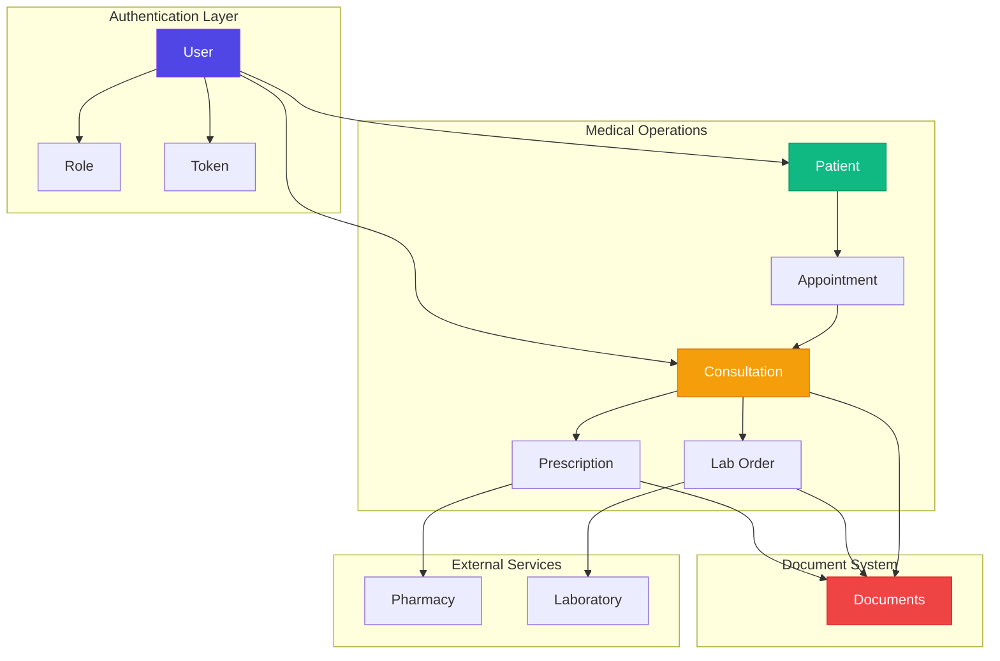

# 🏥 HealthPulse System Architecture
## Complete Class Diagram with Relationships

```mermaid
%%{init: {'theme':'base', 'themeVariables': { 'primaryColor':'#4F46E5','primaryTextColor':'#fff','primaryBorderColor':'#7C3AED','lineColor':'#8B5CF6','secondaryColor':'#10B981','tertiaryColor':'#F59E0B','fontSize':'16px'}}}%%

classDiagram
    %% ═══════════════════════════════════════════════════════════
    %% 🔐 CORE USER MANAGEMENT - Authentication & Authorization
    %% ═══════════════════════════════════════════════════════════
    class User {
        <<Entity>>
        +ObjectId _id
        +String email
        +String password
        +ObjectId roleId
        +String fname
        +String lname
        +String phone
        +Boolean isActive
        +Date lastLogin
        +Date createdAt
        +Date updatedAt
        ---
        +verifyPassword()
        +generateAuthToken()
    }

    class Role {
        <<Authorization>>
        +ObjectId _id
        +String name
        +String description
        +Object permissions
        +Boolean isActive
        +Date createdAt
        +Date updatedAt
        ---
        +hasPermission()
    }

    class RefreshToken {
        <<Security>>
        +ObjectId _id
        +ObjectId userId
        +String token
        +Date expiresAt
        +Date createdAt
        +Date updatedAt
        ---
        +isExpired()
    }

    %% ═══════════════════════════════════════════════════════════
    %% 🏥 PATIENT MANAGEMENT - Patient Records & Information
    %% ═══════════════════════════════════════════════════════════
    class Patient {
        <<Entity>>
        +ObjectId _id
        +String fname
        +String lname
        +String email
        +String phone
        +Date birthDate
        +String gender
        +Object address
        +Object medicalInfo
        +Object insurance
        +Object emergencyContact
        +ObjectId assignedDoctorId
        +ObjectId createdBy
        +Boolean isActive
        +Date createdAt
        +Date updatedAt
    }

    %% ═══════════════════════════════════════════════════════════
    %% 📅 APPOINTMENT MANAGEMENT - Scheduling & Bookings
    %% ═══════════════════════════════════════════════════════════
    class Termin {
        <<Appointment>>
        +ObjectId _id
        +ObjectId patientId
        +ObjectId doctorId
        +Date date
        +String startTime
        +String endTime
        +Number duration
        +String status
        +String type
        +String notes
        +String cancelReason
        +ObjectId createdBy
        +Boolean reminderSent
        +Date completedAt
        +Date cancelledAt
        +Date createdAt
        +Date updatedAt
    }

    %% ═══════════════════════════════════════════════════════════
    %% 🩺 CONSULTATION MANAGEMENT - Medical Examinations
    %% ═══════════════════════════════════════════════════════════
    class Consultation {
        <<Medical Record>>
        +ObjectId _id
        +ObjectId appointmentId
        +ObjectId patientId
        +ObjectId doctorId
        +String consultationType
        +Date consultationDate
        +String status
        +String chiefComplaint
        +String[] symptoms
        +String symptomsDuration
        +String treatmentPlan
        +String[] recommendations
        +Object vitalSigns
        +String diagnosis
        +String[] secondaryDiagnosis
        +String[] icdCodes
        +String severity
        +Object[] labTestsOrdered
        +Object[] imagingOrdered
        +Boolean followUpRequired
        +Date followUpDate
        +String doctorNotes
        +ObjectId prescriptionId
        +Date startTime
        +Date endTime
        +Number duration
        +ObjectId createdBy
        +Boolean isDeleted
        +Date createdAt
        +Date updatedAt
    }

    %% ═══════════════════════════════════════════════════════════
    %% 💊 PRESCRIPTION MANAGEMENT - Medication Orders
    %% ═══════════════════════════════════════════════════════════
    class Prescription {
        <<Medication Order>>
        +ObjectId _id
        +String prescriptionNumber
        +ObjectId consultationId
        +ObjectId patientId
        +ObjectId doctorId
        +Date prescriptionDate
        +String status
        +Medication[] medications
        +ObjectId assignedPharmacyId
        +Date assignedAt
        +Object dispensedBy
        +Boolean isSigned
        +Date signedAt
        +String digitalSignature
        +ObjectId signedBy
        +String doctorNotes
        +String pharmacistNotes
        +Date cancelledAt
        +String cancellationReason
        +ObjectId cancelledBy
        +Boolean isDeleted
        +Date createdAt
        +Date updatedAt
        ---
        +addMedication()
        +signPrescription()
    }

    class Medication {
        <<Drug Information>>
        +String medicationName
        +String genericName
        +String dosage
        +String dosageForm
        +String frequency
        +String route
        +Object duration
        +Number quantity
        +String instructions
        +Date addedAt
    }

    %% ═══════════════════════════════════════════════════════════
    %% 🏪 PHARMACY MANAGEMENT - Pharmacy Network
    %% ═══════════════════════════════════════════════════════════
    class Pharmacy {
        <<Pharmacy Network>>
        +ObjectId _id
        +String pharmacyId
        +String name
        +String licenseNumber
        +Date registrationDate
        +Object contact
        +Object address
        +Object[] operatingHours
        +String[] services
        +Object deliveryService
        +Object[] pharmacists
        +String status
        +Object socialMedia
        +Object[] certifications
        +String[] insuranceAccepted
        +Date createdAt
        +Date updatedAt
    }

    %% ═══════════════════════════════════════════════════════════
    %% 🔬 LABORATORY MANAGEMENT - Lab Tests & Results
    %% ═══════════════════════════════════════════════════════════
    class Laboratory {
        <<Lab Facility>>
        +ObjectId _id
        +String laboratoryId
        +String name
        +String licenseNumber
        +Date registrationDate
        +String accreditation
        +String[] certifications
        +String phone
        +String email
        +String address
        +Object addressDetails
        +Object coordinates
        +Object workingHours
        +Object[] departments
        +Object[] availableTests
        +Object[] staff
        +String[] services
        +String[] specializations
        +Object turnaroundTime
        +Object[] equipment
        +String status
        +Object verificationStatus
        +Date createdAt
        +Date updatedAt
    }

    class LabOrder {
        <<Lab Request>>
        +ObjectId _id
        +String orderNumber
        +ObjectId consultationId
        +ObjectId patientId
        +ObjectId doctorId
        +ObjectId laboratoryId
        +Test[] tests
        +String clinicalIndication
        +String urgency
        +String status
        +Boolean fastingRequired
        +String specialInstructions
        +Date scheduledDate
        +Date sampleCollectedAt
        +ObjectId sampleCollectedBy
        +String[] sampleType
        +Object overallResults
        +Date reportGeneratedAt
        +Boolean isPriority
        +Boolean hasCriticalResults
        +Object[] statusHistory
        +Date createdAt
        +Date updatedAt
        ---
        +addTest()
        +updateTestStatus()
        +cancel()
    }

    class Test {
        <<Lab Test>>
        +String name
        +String code
        +String category
        +String urgency
        +String status
        +String instructions
        +Number expectedTurnaround
        +Mixed results
        +String resultNotes
        +String interpretation
        +Object[] criticalValues
        +ObjectId performedBy
        +Date performedAt
        +Date completedAt
        +String reportUrl
    }

    %% Document Management
    class MedicalDocument {
        +ObjectId _id
        +ObjectId patientId
        +ObjectId uploadedBy
        +String documentType
        +String title
        +String description
        +String fileName
        +String originalFileName
        +Number fileSize
        +String mimeType
        +String fileExtension
        +String minioPath
        +Date documentDate
        +ObjectId consultationId
        +ObjectId labOrderId
        +ObjectId prescriptionId
        +String[] tags
        +String category
        +String confidentialityLevel
        +Object[] accessibleBy
        +Number version
        +Object[] previousVersions
        +String status
        +Boolean isVerified
        +Object[] viewHistory
        +Object[] downloadHistory
        +Date createdAt
        +Date updatedAt
        +recordView()
        +recordDownload()
        +verify()
        +archive()
        +softDelete()
    }

    %% ═══════════════════════════════════════════════════════════
    %% 📄 DOCUMENT MANAGEMENT - Medical Records & Files
    %% ═══════════════════════════════════════════════════════════
    class MedicalDocument {
        <<Document Storage>>
        +ObjectId _id
        +ObjectId patientId
        +ObjectId uploadedBy
        +String documentType
        +String title
        +String description
        +String fileName
        +String originalFileName
        +Number fileSize
        +String mimeType
        +String fileExtension
        +String minioPath
        +Date documentDate
        +ObjectId consultationId
        +ObjectId labOrderId
        +ObjectId prescriptionId
        +String[] tags
        +String category
        +String confidentialityLevel
        +Object[] accessibleBy
        +Number version
        +Object[] previousVersions
        +String status
        +Boolean isVerified
        +Object[] viewHistory
        +Object[] downloadHistory
        +Date createdAt
        +Date updatedAt
        ---
        +recordView()
        +recordDownload()
        +verify()
        +archive()
        +softDelete()
    }

    %% ═══════════════════════════════════════════════════════════
    %% 🔗 RELATIONSHIPS - System Connections
    %% ═══════════════════════════════════════════════════════════
    
    %% Core Authentication Flow
    User "1" --> "1" Role : has role
    User "1" --> "0..*" RefreshToken : generates tokens
    
    %% Patient Management Flow
    Patient "1" --> "1" User : assigned doctor
    Patient "1" --> "1" User : created by
    
    %% Appointment Flow
    Termin "1" --> "1" Patient : for patient
    Termin "1" --> "1" User : with doctor
    Termin "1" --> "1" User : booked by
    
    %% Consultation Flow
    Consultation "0..1" --> "1" Termin : from appointment
    Consultation "1" --> "1" Patient : examines patient
    Consultation "1" --> "1" User : conducted by doctor
    Consultation "1" --> "1" User : recorded by
    Consultation "0..1" --> "1" Prescription : generates prescription
    
    %% Prescription Flow
    Prescription "0..1" --> "1" Consultation : prescribed during
    Prescription "1" --> "1" Patient : prescribed for
    Prescription "1" --> "1" User : prescribed by
    Prescription "1" --> "*" Medication : contains drugs
    Prescription "0..1" --> "1" Pharmacy : dispensed at
    Prescription "0..1" --> "1" User : signed by
    
    %% Laboratory Flow
    LabOrder "1" --> "1" Consultation : ordered during
    LabOrder "1" --> "1" Patient : tests for
    LabOrder "1" --> "1" User : ordered by
    LabOrder "1" --> "1" Laboratory : processed at
    LabOrder "1" --> "*" Test : includes tests
    
    %% Document Flow
    MedicalDocument "1" --> "1" Patient : belongs to
    MedicalDocument "1" --> "1" User : uploaded by
    MedicalDocument "0..1" --> "1" Consultation : attached to
    MedicalDocument "0..1" --> "1" LabOrder : results from
    MedicalDocument "0..1" --> "1" Prescription : copy of
```

---

## 🎯 System Components Overview

### 🔐 Core Authentication & Authorization
- **User Management**: Multi-role system with JWT authentication
- **Role-Based Access**: Granular permissions for different user types
- **Token Security**: Refresh token mechanism for secure sessions
## System Components Overview

### Core Authentication & Authorization
- **User Management**: Multi-role system with JWT authentication
- **Role-Based Access**: Granular permissions for different user types
- **Token Security**: Refresh token mechanism for secure sessions

### Medical Operations
- **Patient Records**: Comprehensive patient information management
- **Appointments**: Smart scheduling with conflict detection
- **Consultations**: Detailed medical examination records
- **Prescriptions**: Digital prescription generation and tracking

### Laboratory Integration
- **Lab Orders**: Seamless test ordering workflow
- **Test Management**: Track individual tests and results
- **Results Reporting**: Automated result delivery system

### Document Management
- **File Storage**: MinIO-based secure document storage
- **Version Control**: Track document versions and changes
- **Access Control**: Fine-grained document permissions

---

## Key Features

- **Real-time Updates**: WebSocket support for live data
- **Security First**: End-to-end encryption for sensitive data
- **Mobile Ready**: RESTful API for mobile applications
- **Audit Trail**: Complete history tracking for all operations
- **Multi-language**: Support for internationalization
- **Analytics**: Built-in reporting and statistics

---

## Relationship Flow

---

**Last Updated**: November 3, 2025 | **Version**: 2.0.0 | **Status**: Production Ready