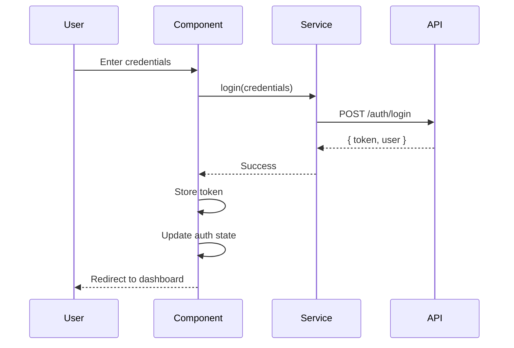
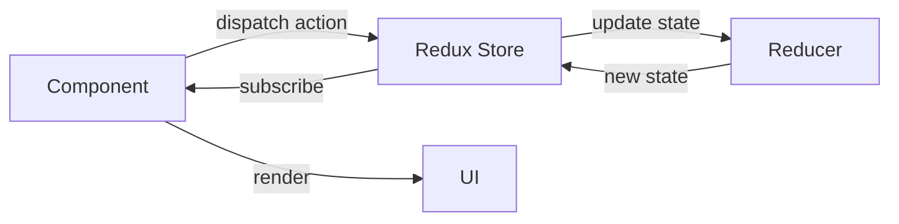

# HealthPulse Frontend

Modern healthcare management system frontend built with React, TypeScript, and Clean Architecture principles.

## 🚀 Tech Stack

- **React 18** - UI Library
- **TypeScript** - Type Safety
- **Vite** - Build Tool
- **Tailwind CSS** - Styling
- **Redux Toolkit** - State Management
- **React Hook Form** - Form Management
- **Zod** - Schema Validation
- **React Query** - Data Fetching
- **React Router** - Routing
- **Axios** - HTTP Client

## 📁 Project Structure

```
src/
├── core/                      # Business Logic Layer
│   ├── domain/               # Enterprise Business Rules
│   │   ├── entities/        # User.ts, Patient.ts, Appointment.ts
│   │   └── interfaces/      # IAuthService.ts, IUserRepository.ts
│   ├── application/         # Application Business Rules
│   │   ├── stores/         # Redux Toolkit stores (authStore.ts, uiStore.ts)
│   │   └── use-cases/      # Business use cases (loginUseCase.ts)
│   └── infrastructure/      # External Interfaces
│       ├── api/            # API clients (axiosInstance.ts, services/)
│       └── storage/        # localStorage.ts, sessionStorage.ts
├── presentation/            # UI Layer
│   ├── components/         # Atomic Design Pattern
│   │   ├── atoms/         # Button, Input, Badge, Label
│   │   ├── molecules/     # FormField, SearchBar, Card
│   │   └── organisms/     # DataTable, Sidebar, Header
│   ├── layouts/           # Page layouts
│   │   ├── AuthLayout.tsx
│   │   └── DashboardLayout.tsx
│   ├── pages/             # Route pages
│   │   ├── auth/         # Login, Register
│   │   ├── admin/        # UserManagement, RoleManagement
│   │   ├── doctor/       # DoctorDashboard, Consultations
│   │   ├── patient/      # PatientDashboard, Appointments
│   │   ├── pharmacist/   # Prescriptions
│   │   └── lab-tech/     # LabOrders
│   └── hooks/            # Custom React hooks
│       ├── useAuth.ts
│       ├── useDebounce.ts
│       └── usePermissions.ts
├── shared/               # Shared utilities
│   ├── constants/       # API_URLS, ROLES, STATUS_CODES
│   ├── types/          # TypeScript definitions
│   └── utils/          # formatters.ts, validators.ts
└── config/             # Configuration
    ├── env.ts
    └── routes.tsx
```

## 🏗️ Architecture Principles

### Clean Architecture
- **Separation of Concerns**: Each layer has a specific responsibility
- **Dependency Rule**: Dependencies point inward (UI → Application → Domain)
- **Testability**: Business logic is independent of frameworks
- **Maintainability**: Easy to modify and extend

### Atomic Design Pattern
- **Atoms**: Basic building blocks (Button, Input)
- **Molecules**: Simple combinations (FormField = Label + Input + Error)
- **Organisms**: Complex components (Sidebar, DataTable)
- **Templates**: Page layouts
- **Pages**: Specific instances

## 🎯 Key Concepts

### State Management

#### Context API
Used for simple, localized state:
- Authentication state
- Theme preferences
- UI state (sidebar, modals)

```tsx
const { user, login, logout } = useAuth();
```

#### Redux Toolkit
Used for complex, global state:
- Users list
- Roles management
- Appointments data

```tsx
const { users, loading } = useAppSelector(state => state.users);
dispatch(fetchUsers());
```

### Form Management

**React Hook Form** with **Zod** validation:
```tsx
const schema = z.object({
  email: z.string().email(),
  password: z.string().min(6),
});

const { register, handleSubmit, formState: { errors } } = useForm({
  resolver: zodResolver(schema),
});
```

### Data Fetching

**React Query** for server state:
```tsx
const { data, isLoading } = useQuery({
  queryKey: ['users'],
  queryFn: () => userService.getAll(),
});
```

### React Hooks

- **useState**: Local component state
- **useEffect**: Side effects and lifecycle
- **useReducer**: Complex state logic
- **useCallback**: Memoize functions
- **useMemo**: Memoize expensive calculations
- **useRef**: DOM references and mutable values

## 🚦 Getting Started

### Prerequisites
```bash
Node.js >= 18.0.0
npm >= 9.0.0
```

### Installation
```bash
# Install dependencies
npm install

# Copy environment variables
cp .env.example .env

# Start development server
npm run dev
```

### Environment Variables
```env
VITE_API_URL=http://localhost:3000/api/v1
VITE_APP_NAME=HealthPulse
```

## 📜 Available Scripts

```bash
# Development
npm run dev              # Start dev server (http://localhost:5173)

# Build
npm run build           # Build for production
npm run preview         # Preview production build

# Code Quality
npm run lint            # Run ESLint
npm run type-check      # Run TypeScript compiler

# Testing
npm run test            # Run tests
npm run test:coverage   # Run tests with coverage
```

## 🎨 Component Examples

### Atom Component
```tsx
// presentation/components/atoms/Button.tsx
interface ButtonProps {
  children: React.ReactNode;
  variant?: 'primary' | 'outline';
  onClick?: () => void;
}

export const Button = ({ children, variant = 'primary', onClick }: ButtonProps) => {
  return (
    <button
      className={`px-4 py-2 rounded ${variant === 'primary' ? 'bg-blue-600 text-white' : 'border'}`}
      onClick={onClick}
    >
      {children}
    </button>
  );
};
```

### Molecule Component
```tsx
// presentation/components/molecules/FormField.tsx
interface FormFieldProps {
  label: string;
  error?: string;
  children: React.ReactNode;
}

export const FormField = ({ label, error, children }: FormFieldProps) => {
  return (
    <div className="space-y-2">
      <label className="block text-sm font-medium">{label}</label>
      {children}
      {error && <p className="text-sm text-red-600">{error}</p>}
    </div>
  );
};
```

### Custom Hook
```tsx
// presentation/hooks/useDebounce.ts
export const useDebounce = <T,>(value: T, delay: number = 500): T => {
  const [debouncedValue, setDebouncedValue] = useState<T>(value);

  useEffect(() => {
    const handler = setTimeout(() => setDebouncedValue(value), delay);
    return () => clearTimeout(handler);
  }, [value, delay]);

  return debouncedValue;
};
```

## 🔐 Authentication Flow



## 📊 State Management Flow



## 🎓 Learning Resources

### Documentation
- [Workflow & Concepts](./docs/WORKFLOW_CONCEPTS.md) - Detailed guide on architecture and patterns
- [Redux Toolkit](https://redux-toolkit.js.org/)
- [React Hook Form](https://react-hook-form.com/)
- [React Query](https://tanstack.com/query/latest)
- [Zod](https://zod.dev/)

### Key Topics
1. **State Management**: Context API vs Redux Toolkit
2. **Form Management**: Controlled vs Uncontrolled forms
3. **Data Fetching**: React Query patterns
4. **React Hooks**: useState, useEffect, useReducer, useCallback, useMemo, useRef
5. **Performance**: Memoization and optimization techniques

## 🧪 Testing

```bash
# Unit tests
npm run test

# Integration tests
npm run test:integration

# E2E tests
npm run test:e2e
```

## 📦 Build & Deployment

```bash
# Build for production
npm run build

# Preview production build
npm run preview

# Deploy (example with Vercel)
vercel deploy
```

## 🤝 Contributing

1. Follow the established architecture patterns
2. Use TypeScript for type safety
3. Write meaningful commit messages
4. Add tests for new features
5. Update documentation

## 📝 Code Style

- **ESLint**: Enforces code quality
- **Prettier**: Code formatting
- **TypeScript**: Type safety
- **Conventional Commits**: Commit message format

## 🐛 Troubleshooting

### Common Issues

**Port already in use**
```bash
# Kill process on port 5173
lsof -ti:5173 | xargs kill -9
```

**Module not found**
```bash
# Clear cache and reinstall
rm -rf node_modules package-lock.json
npm install
```

**Type errors**
```bash
# Regenerate types
npm run type-check
```

## 📄 License

MIT License - see LICENSE file for details

## 👥 Team

Built with ❤️ by the HealthPulse Team

---

**For detailed workflow and concepts, see [WORKFLOW_CONCEPTS.md](./docs/WORKFLOW_CONCEPTS.md)**
